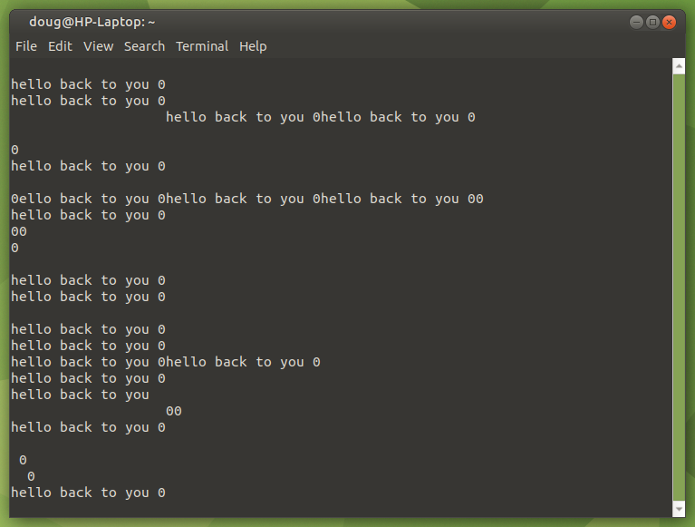
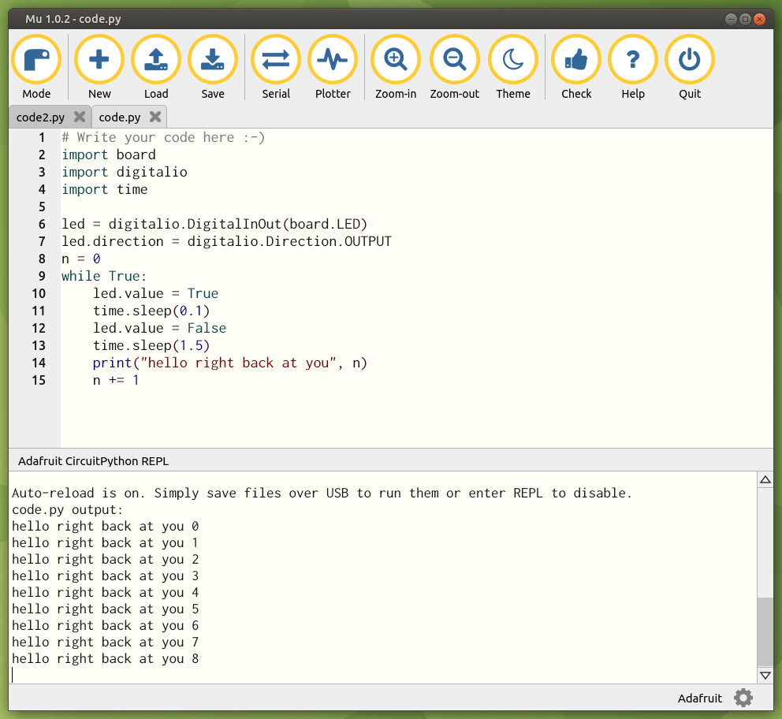
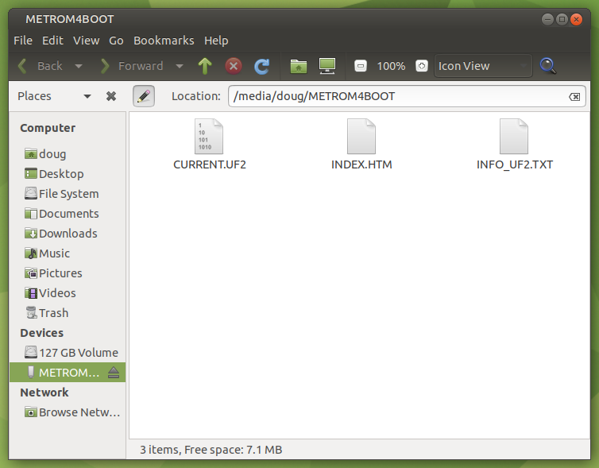
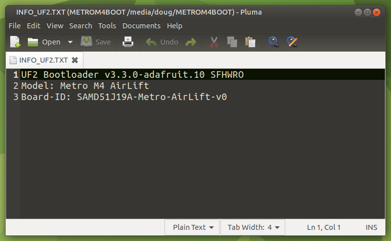

# Geting started: Learning to use Circuit Python / Adafruit Metro M0 Express
I got an email from Gerald Swan on the VHOT channel alerting me to [this project](https://makezine.com/projects/perpetual-battery-free-weather-station/) which describes a Perpetual Battery-Free Weather Station project that is:
* Solar powered
* Uses no batteries
* Builds a "BFree" board (from scratach) which:
    * Detects when power is available from the solar cell to charge a super capacitor
    * Uses power from the super cap to power itself and an Adafruit microprocessor board which:
        * Runs a circuit python script which broadcasts data over LoRa
    * Periodically collects values from the python interpreter stack and stores them in non-volatile ram 
    * Supplies the stored values to micropython when it resumes from where it left off after a hard shutdown.
    
This project appeals to me because it promises to introduce me to several interesting new things:
* Circuit python running on a micorcontroller
* LoRa
* Custom circuit boards. This would be my first ever order of a custom circuit board.
* No Batteries: It would allow the python interpreter to gracefully endure hard shutdowns.
* Project was advertised to be **Easy** and **Cheap** (< $50)


## After I dove in and started ordering parts:
 
* I began to realize that the project was not easy and not cheap
* A tidy BOM was not provided, so I scratched around for all the parts I was going to need and started to order them.
* It soon became clear that the total was going to be hundreds of $$ with many parts only available from overseas with long lead times.
* Just building the circuit board looked like it was going to be a major project.
* When I found myself watching videos on how to solder 100-pin surface mount chips, I decided it was time to fall back and rethink this endeavor.

## I decided to approach this project in stages.

### Stage 1: Get the Adafruit Metro M0 Express (It's already on order)
* Learn how to install the python interpreter on it and get some practice using it.
* Get some experience with LoRa 

### Stage 2: Do I really need to mess with the values on the python interpreter stack?

* Here's an idea:
    * When the solar cell can't keep the cap charged up, just allow everything to shut down.
    * When the power comes back, turn the microprocessor back on, and re-initialize the python script.

## Using the Adafruit Metro M0 Express
* <a href="https://learn.adafruit.com/adafruit-metro-m0-express/overview" target="_blank">Overview</a>
* <a href="https://learn.adafruit.com/welcome-to-circuitpython" target="_blank">Circuit Python</a>
    * This tutorial depends on being able to use the Mu Editor, which is especially well suited to working with Circuit Python
        * Getting the Mu editor to work on Ubuntu was a problem.
        * I installed it using snap but wasn't able to get it to work in CircuitPython mode.
            * But I did eventually get it working... See below.
        * I ended up going through this tutorial on Windows 10 just because the Mu Editor worked
            * (Almost worked). The REPL did not work using Ctrl+C
                * The screenshots in the tutorial showed the REPL working on MacOS.
    * They do show the possibility of using PyCharm on Ubuntu instead.
        * First, I needed to change a couple of settings to disable auto-save.
        * It can be used as an editor now, but there is no interactive console and no REPL
        * So far, I think that PyCharm on linux falls far short of the capability of Mu on Windows 10.
    * On the [Recommended Editors](https://learn.adafruit.com/welcome-to-circuitpython/recommended-editors) page, they explain the 2 main problems to be avoided with editors:
        1. Auto saving (Circuit detects whenever the Python file is saved and automatically uploads)
        2. "Sluggish"  saving. (Some editors can take a long time to save, not writing all changes immediately)
    * It is mentioned that IDLE, in Python 3.8.1 or later, was fixed to write all changes immediately.
    * One way to have an interactive serial console is to use 'screen'
        * `screen /dev/ttyACM0 115200` or `sudo screen /dev/ttyACM0 115200`
        * `Ctrl-C` to go to REPL
        * `Ctrl-D` to go back to serial console
    * But this doesn't doesn't work very well:



## For my needs, CircuitPython is still just a toy. I hope it gets better with time.
* The attraction (to me): Enable coding microprocessors using Python (instead of C/C++).
* For example, You can send emails using Arduino (C/C++) and you can do it using Python, but it currently cannot be done in CircuitPython.

## It would still be interesting to explore the use of a solar cell and super cap to power a microprocessor
* shutting down the the microprocessor when dark
* Restarting the microporcessor when the power comes back

# Try to get the Mu Editor working properly
## Remove the snap installation of Mu editor then re-installed it using pip and apt
* First I Googled the following: install mu-editor on ubuntu 
* `sudo snap remove mu-editor`
* Removed conda initialize section from  `.bashrc` in order to expose python3.
``` .bashrc
# >>> conda initialize >>>
# !! Contents within this block are managed by 'conda init' !!
__conda_setup="$('/home/doug/anaconda3/bin/conda' 'shell.bash' 'hook' 2> /dev/null)"
if [ $? -eq 0 ]; then
    eval "$__conda_setup"
else
    if [ -f "/home/doug/anaconda3/etc/profile.d/conda.sh" ]; then
        . "/home/doug/anaconda3/etc/profile.d/conda.sh"
    else
        export PATH="/home/doug/anaconda3/bin:$PATH"
    fi
fi
unset __conda_setup
# <<< conda initialize <<<
```
* `which python3`  ->  `/usr/bin/python3`
* `pip3 install mu-editor`
* `sudo apt install mu-editor`
* Plug in Metro board
* Start Mu editor: `mu-editor`
* Mu works perfectly!
* Replace conda initialize section baqck into `.bashrc` file.
* Start Mu editor: `mu-editor`
* Mu **still** works perfectly!



There is no launcher on the start menu so I followed the advice at [Install Mu on Ubuntu](https://ubunlog.com/en/mu-editor-python-principantes/) and did the following steps:
* `pip3 install shortcut`
* `shortcut mu-editor`
* Shutdown and restart.
* Now I have mu-editor on my start menu, but it crashes on launch.
* The same result when I try to launch at the command line.

## Oh wait! I just noticed a little  on my desktop.
* When clicked, it launches mu-editor (and it doesn't crash!)
* It turns out that I installed mu-editor **twice**
    * Using pip3
        * Found install location using: `pip show mu-editor` -> ~/.local
    * Using sudo apt
        * Found install location using: `dpkg -L mu-editor` -> /usr/bin and /usr/share
* The pip3 installed version was the one that was failing to launch.
    * Removed it using: `pip3 uninstall mu-editor`
* Everything seems to be good again. mu-editor can be launched either
    * from the start menu
    * or with the desktop shortcut

## Using Mu:

* At the REPL, type: `help("modules")` to see all built-in modules

## [Metro M4 Express AirLift (Wifi)](https://learn.adafruit.com/adafruit-metro-m4-express-airlift-wifi)
* Initial setup of board:
    * plug in to USB
    * Double click rest button on board
        * This causes board to be mounted and open in file manager



* Open INFO_UF2.TXT
        


* Downloaded adafruit-circuitpython-metro_m4_airlift_lite-en_US-7.3.3.uf2
* Dragged and dropped it onto boot drive
* Now CIRCUITPY is mounted under /media/doug
* Errors when trying to run sample code.py
    * MpyError: Incompatible .mpy file. Please update all .mpy files.
* Updated all libraries under lib with ones from 7.x bundle
* Still got an error when trying to run the sample code.py
    * ImportError: no module named 'adafruit_esp32spi.adafruit_esp32spi_requests'
    * The new `adafruit_esp32spi` folder doesn't have this file in it
    * Solved ImportError by: 
        * replacing `import adafruit_esp32spi.adafruit_esp32spi_requests as requests`
        * with `import adafruit_requests as requests`
    * Then commented out some code in the loop that wasn't working
```
>>> help("modules")
__future__        builtins          onewireio         touchio
__main__          busio             os                traceback
_asyncio          collections       paralleldisplay   ulab
_bleio            countio           ps2io             ulab
_eve              digitalio         pulseio           ulab.fft
adafruit_bus_device                 displayio         pwmio             ulab.linalg
adafruit_bus_device.i2c_device      errno             rainbowio         ulab.numpy
adafruit_bus_device.spi_device      floppyio          random            ulab.scipy
adafruit_pixelbuf fontio            re                ulab.scipy.linalg
aesio             framebufferio     rgbmatrix         ulab.scipy.optimize
alarm             frequencyio       rotaryio          ulab.scipy.signal
analogio          gc                rtc               ulab.scipy.special
array             getpass           samd              ulab.utils
atexit            gifio             sdcardio          usb_cdc
audiobusio        i2cperipheral     select            usb_hid
audiocore         io                sharpdisplay      usb_midi
audioio           json              storage           uselect
audiomixer        keypad            struct            vectorio
audiomp3          math              supervisor        watchdog
binascii          microcontroller   synthio           zlib
bitbangio         micropython       sys
bitmaptools       msgpack           terminalio
board             neopixel_write    time
Plus any modules on the filesystem
```

## Try [Internet Connect!](https://learn.adafruit.com/adafruit-metro-m4-express-airlift-wifi/internet-connect-2)
* This uses the following imports:
```
import board
import busio
from digitalio import DigitalInOut
import adafruit_requests as requests
import adafruit_esp32spi.adafruit_esp32spi_socket as socket
from adafruit_esp32spi import adafruit_esp32spi
```
* This struggled for a long time but eventually worked!
```
ESP32 SPI webclient test
ESP32 found and in idle mode
Firmware vers. bytearray(b'1.2.2\x00')
MAC addr: ['0x20', '0xbf', '0x1e', '0x51', '0x91', '0x40']
	NETGEAR90		RSSI: -54
	WRCHPD		RSSI: -88
	Jim Wifi		RSSI: -89
	Gators		RSSI: -90
	CenturyLink3384_EXT		RSSI: -91
	Cummins1801		RSSI: -92
	CaptionCall2_298115		RSSI: -93
	WM314a3c		RSSI: -93
Connecting to AP...
could not connect to AP, retrying:  ('Failed to connect to ssid', b'NETGEAR90')
could not connect to AP, retrying:  ('Failed to connect to ssid', b'NETGEAR90')
could not connect to AP, retrying:  ('Failed to connect to ssid', b'NETGEAR90')
could not connect to AP, retrying:  ('Failed to connect to ssid', b'NETGEAR90')
could not connect to AP, retrying:  ('Failed to connect to ssid', b'NETGEAR90')
could not connect to AP, retrying:  ('Failed to connect to ssid', b'NETGEAR90')
could not connect to AP, retrying:  ('Failed to connect to ssid', b'NETGEAR90')
could not connect to AP, retrying:  ('No such ssid', b'NETGEAR90')
could not connect to AP, retrying:  ('Failed to connect to ssid', b'NETGEAR90')
could not connect to AP, retrying:  ('Failed to connect to ssid', b'NETGEAR90')
could not connect to AP, retrying:  ('Failed to connect to ssid', b'NETGEAR90')
could not connect to AP, retrying:  ('Failed to connect to ssid', b'NETGEAR90')
could not connect to AP, retrying:  ('Failed to connect to ssid', b'NETGEAR90')
could not connect to AP, retrying:  ('Failed to connect to ssid', b'NETGEAR90')
could not connect to AP, retrying:  ('No such ssid', b'NETGEAR90')
could not connect to AP, retrying:  ('Failed to connect to ssid', b'NETGEAR90')
Connected to NETGEAR90 	RSSI: -50
My IP address is 192.168.1.22
IP lookup adafruit.com: 104.20.38.240
Ping google.com: 170 ms
Fetching text from http://wifitest.adafruit.com/testwifi/index.html
----------------------------------------
This is a test of Adafruit WiFi!
If you can read this, its working :)
----------------------------------------

Fetching json from http://api.coindesk.com/v1/bpi/currentprice/USD.json
----------------------------------------
{'time': {'updated': 'Jan 27, 2023 11:25:00 UTC', 'updatedISO': '2023-01-27T11:25:00+00:00', 'updateduk': 'Jan 27, 2023 at 11:25 GMT'}, 'disclaimer': 'This data was produced from the CoinDesk Bitcoin Price Index (USD). Non-USD currency data converted using hourly conversion rate from openexchangerates.org', 'bpi': {'USD': {'code': 'USD', 'description': 'United States Dollar', 'rate_float': 22959.1, 'rate': '22,959.0809'}}}
----------------------------------------
Done!
```
* Whew! What a struggle that was!
* Added timezone string to secrets
* Ran it again but it took even longer to connect this time!
```
code.py output:
ESP32 SPI webclient test
ESP32 found and in idle mode
Firmware vers. bytearray(b'1.2.2\x00')
MAC addr: ['0x20', '0xbf', '0x1e', '0x51', '0x91', '0x40']
	NETGEAR90		RSSI: -54
	Jim Wifi		RSSI: -88
	WRCHPD		RSSI: -88
	Gators		RSSI: -90
	Kiwi		RSSI: -92
	CaptionCall2_298115		RSSI: -94
Connecting to AP...
could not connect to AP, retrying:  ('No such ssid', b'NETGEAR90')
could not connect to AP, retrying:  ('Failed to connect to ssid', b'NETGEAR90')
could not connect to AP, retrying:  ('Failed to connect to ssid', b'NETGEAR90')
could not connect to AP, retrying:  ('Failed to connect to ssid', b'NETGEAR90')
could not connect to AP, retrying:  ('Failed to connect to ssid', b'NETGEAR90')
could not connect to AP, retrying:  ('No such ssid', b'NETGEAR90')
could not connect to AP, retrying:  ('Failed to connect to ssid', b'NETGEAR90')
could not connect to AP, retrying:  ('Failed to connect to ssid', b'NETGEAR90')
could not connect to AP, retrying:  ('Failed to connect to ssid', b'NETGEAR90')
could not connect to AP, retrying:  ('Failed to connect to ssid', b'NETGEAR90')
could not connect to AP, retrying:  ('Failed to connect to ssid', b'NETGEAR90')
could not connect to AP, retrying:  ('Failed to connect to ssid', b'NETGEAR90')
could not connect to AP, retrying:  ('Failed to connect to ssid', b'NETGEAR90')
could not connect to AP, retrying:  ('Failed to connect to ssid', b'NETGEAR90')
could not connect to AP, retrying:  ('Failed to connect to ssid', b'NETGEAR90')
could not connect to AP, retrying:  ('Failed to connect to ssid', b'NETGEAR90')
could not connect to AP, retrying:  ('Failed to connect to ssid', b'NETGEAR90')
could not connect to AP, retrying:  ('Failed to connect to ssid', b'NETGEAR90')
could not connect to AP, retrying:  ('Failed to connect to ssid', b'NETGEAR90')
could not connect to AP, retrying:  ('Failed to connect to ssid', b'NETGEAR90')
could not connect to AP, retrying:  ('No such ssid', b'NETGEAR90')
could not connect to AP, retrying:  ('Failed to connect to ssid', b'NETGEAR90')
could not connect to AP, retrying:  ('Failed to connect to ssid', b'NETGEAR90')
could not connect to AP, retrying:  ('Failed to connect to ssid', b'NETGEAR90')
could not connect to AP, retrying:  ('Failed to connect to ssid', b'NETGEAR90')
could not connect to AP, retrying:  ('No such ssid', b'NETGEAR90')
could not connect to AP, retrying:  ('Failed to connect to ssid', b'NETGEAR90')
could not connect to AP, retrying:  ('Failed to connect to ssid', b'NETGEAR90')
could not connect to AP, retrying:  ('Failed to connect to ssid', b'NETGEAR90')
could not connect to AP, retrying:  ('Failed to connect to ssid', b'NETGEAR90')
could not connect to AP, retrying:  ('Failed to connect to ssid', b'NETGEAR90')
could not connect to AP, retrying:  ('Failed to connect to ssid', b'NETGEAR90')
could not connect to AP, retrying:  ('No such ssid', b'NETGEAR90')
could not connect to AP, retrying:  ('Failed to connect to ssid', b'NETGEAR90')
could not connect to AP, retrying:  ('Failed to connect to ssid', b'NETGEAR90')
could not connect to AP, retrying:  ('No such ssid', b'NETGEAR90')
could not connect to AP, retrying:  ('Failed to connect to ssid', b'NETGEAR90')
could not connect to AP, retrying:  ('No such ssid', b'NETGEAR90')
could not connect to AP, retrying:  ('Failed to connect to ssid', b'NETGEAR90')
Connected to NETGEAR90 	RSSI: -52
My IP address is 192.168.1.22
IP lookup adafruit.com: 104.20.38.240
Ping google.com: 240 ms
Fetching text from http://wifitest.adafruit.com/testwifi/index.html
----------------------------------------
This is a test of Adafruit WiFi!
If you can read this, its working :)
----------------------------------------

Fetching json from http://api.coindesk.com/v1/bpi/currentprice/USD.json
----------------------------------------
{'time': {'updated': 'Jan 27, 2023 11:46:00 UTC', 'updatedISO': '2023-01-27T11:46:00+00:00', 'updateduk': 'Jan 27, 2023 at 11:46 GMT'}, 'disclaimer': 'This data was produced from the CoinDesk Bitcoin Price Index (USD). Non-USD currency data converted using hourly conversion rate from openexchangerates.org', 'bpi': {'USD': {'code': 'USD', 'description': 'United States Dollar', 'rate_float': 22971.9, 'rate': '22,971.8639'}}}
----------------------------------------
Done!
```

## Install [NTP dependencies](https://docs.circuitpython.org/projects/ntp/en/latest/index.html)
* `pip3 install adafruit-circuitpython-ntp`


## [Adafruit NTP example](https://docs.circuitpython.org/projects/ntp/en/latest/examples.html#)
``` python
import adafruit_ntp
import socketpool
import time
import wifi

# Get wifi details and more from a secrets.py file
try:
    from secrets import secrets
except ImportError:
    print("WiFi secrets are kept in secrets.py, please add them there!")
    raise

wifi.radio.connect(secrets["ssid"], secrets["password"])

pool = socketpool.SocketPool(wifi.radio)
ntp = adafruit_ntp.NTP(pool, tz_offset=-5)

while True:
    print(ntp.datetime)
    time.sleep(1)
```
* This does not work on the Metro M4 Express AirLift (WiFi) board!
* I have not been able to find the `socketpool` or `wifi` libraries
* I posted a request for help on the [adafruit forum](https://forums.adafruit.com/viewtopic.php?t=198244)
    * There I learned that **there are no socketpool and wifi libraries** for the Metro M4 Express AirLift (WiFi) board
    * They are builtin modules, but seem to be for ESP32 family based boards. E.g. the [Metro ESP32-S2](https://www.adafruit.com/product/4775)
    * The [Adafruit NTP example](https://docs.circuitpython.org/projects/ntp/en/latest/examples.html#id1) code is intended to work specifically on the Adafruit ESP32 family based boards.
    * The [Internet Connect!](https://learn.adafruit.com/adafruit-metro-m4-express-airlift-wifi/internet-connect-2) code is the only way for the Metro M4 Express AirLift (WiFi) board to conneect to the internet.
    * I wasn't able to convince them that the **repeated failures** to connect was an unacceptable problem.
    * John Park's [set your board's RTC with the NTP time server](https://www.youtube.com/watch?v=JQy4fg8uey4) looks like it is also intended for the ESP32-S2.
        * [Set RTC](https://docs.circuitpython.org/projects/ntp/en/latest/examples.html#set-rtc) code
        
# Summarizing:
* I got a fair amount of **experience** using CircuitPython
    * I liked it!
        * To me, programming in Python is **FUN**
        * Programming in Arduino (C/C++) is more like **work**
    * I got the **Mu-Editor** working seamlessly in Ubuntu
    * Drag & Drop firmware (uf2 files) works slick!
    * Lightning fast pin response (works for encoders)
    * It's all very easy to use
    * Adafruit Forum is very responsive to posts about issues/questions with their products.
* I got some experience using [Adafruit IO](https://learn.adafruit.com/welcome-to-adafruit-io)
    * It turns out that CircuitPython and Adafruit IO are **mutually exclusive**.
        * It's one or the other. Not both.
        * Once you load the Adafruit IO firmware: 
            * Your board ends up as a "doorway device" to the Adafruit IO cloud service, enabling display and interaction with sensors that are connected to it.
            * Your lib folder (containing CircuitPython libraries) vanishes
            * Your `code.py` file is still there, but it doesn't work.
            * The Serial connection to the board just says "PING!" every 15 seconds as it corresponds with the cloud service.
* The [Adafruit Metro M0 Express](https://learn.adafruit.com/adafruit-metro-m0-express/overview) board doesn't have WiFi, but it is well suited to the job of regulating the speed of my grandfather clock once I attached an RTC board.
* If you need WiFi (as to connect to an NTP server), the Metro M4 Express AirLift (WiFi) board **doesn't cut it**. But it seems to do a great job of communicatiing with the Adafruit IO cloud service every 15 seconds.
* In the hopes of finding a board that runs CircuitPython **and** is nimble in connecting to the internet, I have ordered a Metro ESP32-S2 Express board and will check it out.
    * It is WiFi capable
    * It can be programmed in CircuitPython (as well as Arduino)
    * Has an onboard RTC (I think)

* Continue reading about <a href="ESP32-S2.md" target="_blank">Metro ESP32-S2</a>
