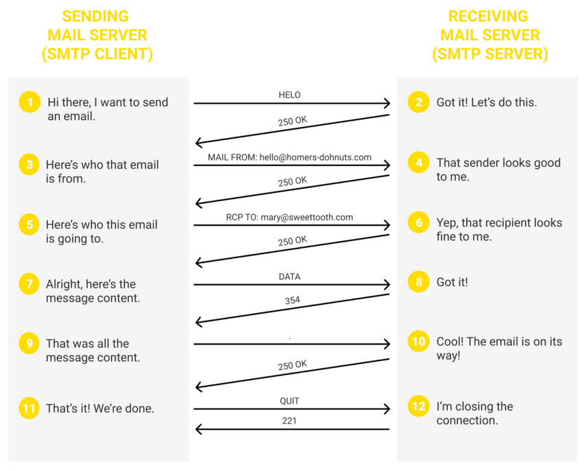

# Notes on setting up email on CircuitPython

* [My question on the CircuitPython Forum](https://forums.adafruit.com/viewtopic.php?p=963132#p963132)
* [Docs for MicroPython socket module](https://docs.micropython.org/en/latest/library/socket.html)
* [CircuitPython socketpool doc](https://docs.circuitpython.org/en/latest/shared-bindings/socketpool/index.html)
* Martin’s Atelier [Simple SMTP from Python](https://mjoldfield.com/atelier/2021/11/python-smtp.html)
    * My version [send_email.py](send_email.py)
    * I tried to get it to work by using gmail as the smtp server but it does
not work. The gmail server complains that I need to send the command to
STARTTLS and then communicate in TLS mode.
* [mymail.py](mymail.py)
    * This is my attempt to adapt uMail.py (for microPython) to work under CircuitPython
* [How does SMTP work?](https://postmarkapp.com/guides/everything-you-need-to-know-about-smtp)



* <a href="https://www.samlogic.net/articles/smtp-commands-reference.htm" target="_blaank">SMTP Commands Reference</a>


```
< 220 smtp.gmail.com ESMTP c194-20020a379acb000000b0071aacb2c76asm5392433qke.132 - gsmtp
< 250-smtp.gmail.com at your service, [73.120.185.228]
250-SIZE 35882577
250-8BITMIME
250-STARTTLS
250-ENHANCEDSTATUSCODES
250-PIPELINING
250-CHUNKING
250 SMTPUTF8

...

< 250-smtp.gmail.com at your service, [73.120.185.228]
250-SIZE 35882577
250-8BITMIME
250-STARTTLS
250-ENHANCEDSTATUSCODES
250-PIPELINING
250-CHUNKING
250 SMTPUTF8

...

Traceback (most recent call last):
  File "code.py", line 139, in <module>
  File "code.py", line 72, in __init__
  File "code.py", line 83, in login
AssertionError: no auth method
```
