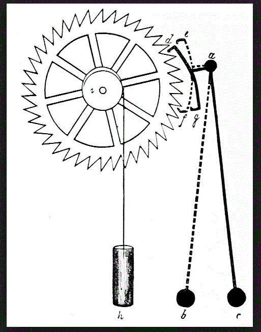
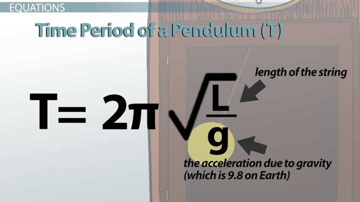
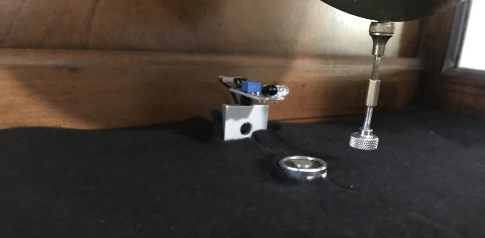
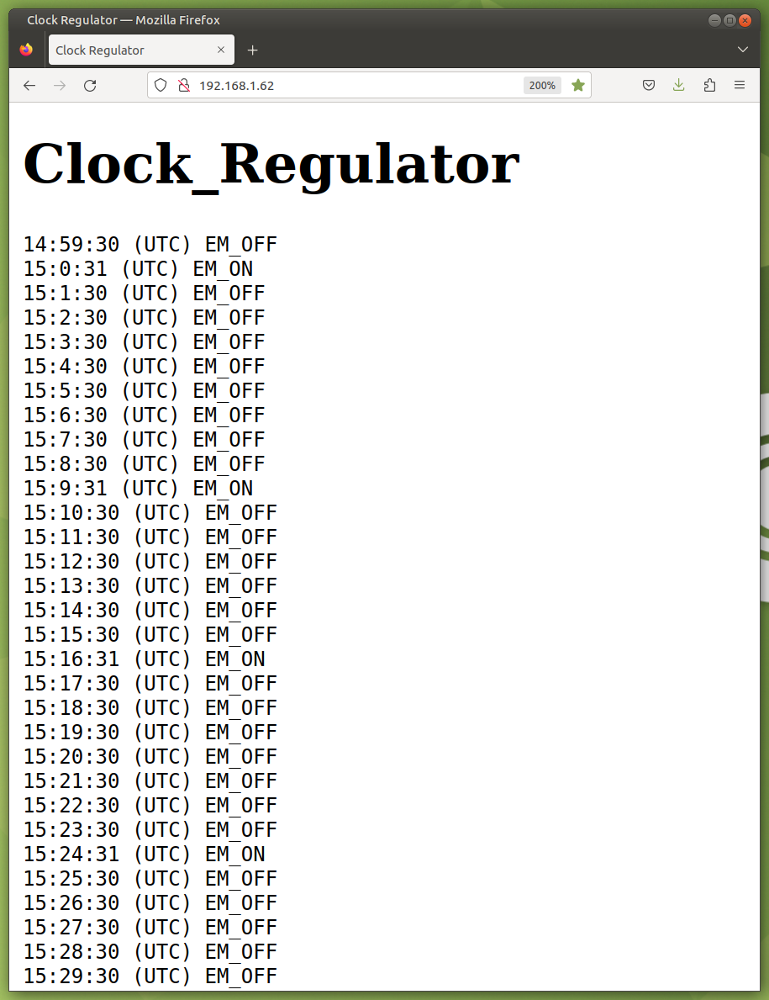

# Using an electro-magnet to regulate the speed of a grandfather clock

## How a standard grandfather clock works:
* A grandfather clock relies on a swinging pendulum to maintain the speed of the clock.
* The natural period of oscillation of the swinging pendulum is exactly determined by the length of the pendulum and the downward force of gravity.
* The mass of the pendulum **bob** is not a factor in the equation.

* A typical grandfater clock "ticks" at a rate of exactly **66 ticks per minute**
* The period of oscillation **T** is equal to the time for the pendulum to make **2 Ticks**

## How the speed of a grandfather clock can be influnced:

* By placing an [electro-magnet](https://www.amazon.com/gp/product/B07H3V8N2Q/ref=ppx_yo_dt_b_asin_title_o03_s00?ie=UTF8&psc=1) below the pendulum at the bottom dead center (BDC) position, we can use the electro-magnet to slightly **augment** the force of gravity.
* By energizing the elecro-magnet, the period of oscillation will be slightly reduced, thus **speeding up the clock** slightly.

## How the speed of the grandfather clock is detected

* An [infrared sensor module](https://www.amazon.com/dp/B07FJLMLVZ?psc=1&ref=ppx_yo2ov_dt_b_product_details) is positioned to detect the pendulum as it swings through BDC.
* This sensor generates a brief pulse every time the pendulum crosses BDC.
* The pulses are counted.
* With every 66 pulses, the time given by the microprocessor's RTC should show another elapsed minute.

## Mechanical configuration:

## The way the program works:

* The Pendulum length is adjusted to make the clock run slightly **SLOW**
* After every 66 pulses, the value of **s** (seconds given by the RTC) is obtained.
    * If the value exceeds the target value, the electro-magnet is energized
    * Otherwise, the electro-magnet is turned off.
* In operation, the electro-magnet is off most of the time, turning on for one minute every so often.
* Since the microprocessor is onboard the clock, running in **headless** mode, the program also runs a webserver to show its recent performance.
* As seen in the image below, the clock is running slightly slow, so after 7 (+/-) batches of 66 pulses, the value of `s` changes from the target value of `30` to `31`, causing the electro-magnet to be energized.

