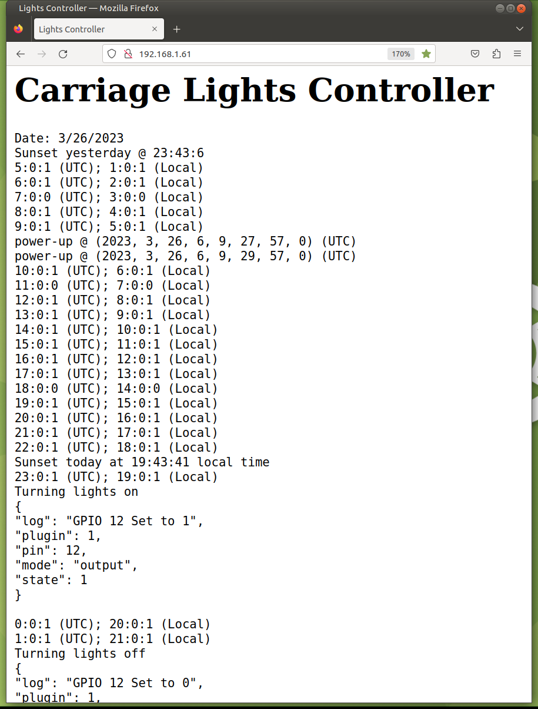

# Automatic Lights Control

* This project is an automatic control program for the outdoor *carriage lights* located on the facade of my house.
* The lights are on a circuit which contains a Sonoff device inside the wall switch box.
* The Sonoff switch is programmed with ESPEasy, allowing it to be actuated either:
    * Manually by clicking the wall switch or
    * Programatically by sending an http `get` request.
* The control program is written in MicroPython running on a Raspberry Pi Pico W
* The Pico is running in "headless" mode, so in order to make its daily data visible, it also includes a webserver operating asynchronously.
* By choosing to program the controller and webserver to operate asynchronously (using asyncio) rather than using two threads, there is no need to be concerned with the possibility of race condtions (as could happen if the loops were on two separate threads).
* The screenshot below shows the data displayed on its web interface:

