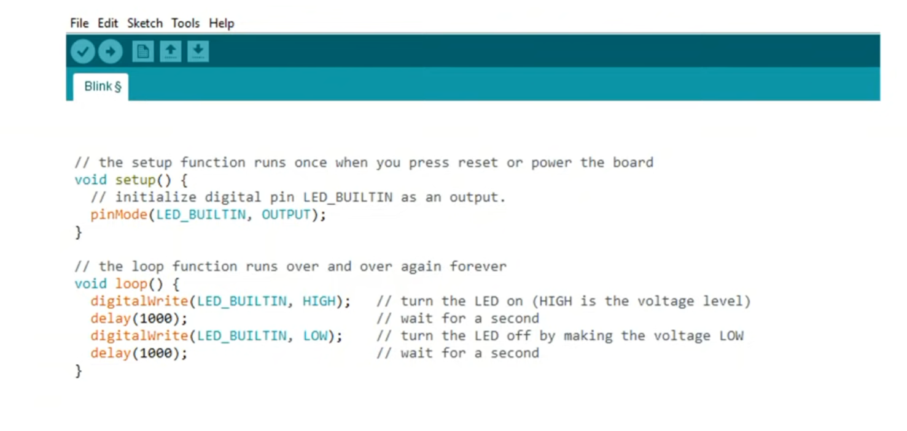

# The Explosively Popular & Powerful Python Programming Language
## An Overview of the language and its recent use for programming microcontrollers


* I have been using Python for almost a quarter of a century now.
* In 2000, I read Mark Lutz's book **Learning Python** and used a project example from the book to build an online CGI website for automating the administration of a squash box-league at Kodak.
* Python (then at version 1.5.2) was much smaller, but already very capable.
* Since then, it has evolved through version 2 and is now at version 3.11


## Factors contributing to Python's explosive popularity

* Powerful, yet beginner friendly
* High level
    * Easy to learn
    * Easy to read
    * Easy to write
    * FUN to use
* Designed to have a compact core but to be highly extensible via modules.
    * This has enabled the creation of an immense ecosystem of libraries and extension modules


* Python has become popular in many diverse fields of interest
    * General scripting
    * Hacking (both ethical and non-ethical)
    * Server-side scripting language for Web Applications
    * Data Science
    * Scientific Computing
    * AI
    * Machine Learning
    * 3D graphics
    * Computer vision
    * Games
    * Natural language processing

* Designed to be a high-level programming language
    * having a strong abstraction from the details of the computer
    * uses natural language elements, making it more intuitive and easy to use
    * uses **indentation** to define code blocks
    * automates or hides low-level details of the interface with the computer
        * eg.: memory management
            * Allocation
            * Deallocation (automatic garbage collection)
            * the stack
            * the heap
    * Dynamically typed

* Designed to be a general-purpose programming language that can be extended by importing modules

* Supports multiple programming paradigms
    * Object-oriented programming (OOP)
        * A programming paradigm based on the concept of "objects", which can contain data and code. The data is in the form of fields (often known as attributes or properties), and the code is in the form of procedures (often known as methods)
    * Structured programming
        * A programming paradigm aimed at improving the clarity, quality, and development time of a computer program by making extensive use of the structured control flow constructs of selection (if/then/else) and repetition (while and for), block structures, and subroutines.
    * Functional programming
        * A programming paradigm where programs are constructed by applying and composing functions. It is a declarative programming paradigm in which function definitions are trees of expressions that map values to other values, rather than a sequence of imperative statements which update the running state of the program.
In functional programming, functions are treated as first-class citizens, meaning that they can be bound to names (including local identifiers), passed as arguments, and returned from other functions, just as any other data type can.

* Pyhon code is **interpreted**, not **compiled**

## What does it mean for a language to be Interpreted vs Compiled?

* In a **compiled** language
    * Source code must be converted (compiled) into machine code so that it can be executed by the processor.
        * This machine code will run **only** on the target device for which it was compiled.
            * Windows, MacOS, Linux, etc.
        * Once compiled, the code can run very fast.
        * Ideal for a device with limited resources because the machine code runs directly on the CPU.
* In an **interpreted** language
    * Source code instructions are read and executed sequentially at run time.
        * A significant advantage of an interpreted language is that it does not have to be compiled for each hardware target separately.
        * A disadvantage is that interpreted code does not run as fast as compiled code.
        * A Python interpreter is available for pretty much every computer operating system.
        * However, an interpreter is too big to fit on a microcontroller.

##  What languages can be used to program a Microcontroller?
* Because of the limited resources (processor speed, ROM, RAM) available on a microcontroller, a **compiled** language (such as C) has long been the obvious choice. For Arduino, the one obvious choice is **C for Arduino**.
* A full-fledged Python3 interpreter is too big to fit on a microcontroller. So the developers have created a special version of Python with stripped-down libraries that will fit on a microcontroller. This is known as MicroPython (Python for Microcontrollers).
* MicroPython, has been written in C to be compatible with Python version 3.4 but has been optimized to run on a microcontroller. It consists of a Python compiler to bytecode and a runtime interpreter of that bytecode. It includes a selection of core Python libraries plus some modules which give the programmer access to low-level hardware of the microcontroller.


## The topology of the MicroPython configuration
* Last month at FOSDEM'23, Wouter van Ooijen presented an excellent talk [A Quick Introduction to MicroPython](https://ftp.osuosl.org/pub/fosdem/2023/UD2.218A/python_micropython_intro.mp4).
* His slides will help us visualize the configuration of MicroPython setup to run on a microcontroller.


## How is MicroPython the same / different from Python?
* The syntax and coding style of MicroPython is the same as full Python
    * [MicroPython implements Python 3.4 and some select features of Python 3.5 and above](https://docs.micropython.org/en/latest/genrst/index.html)
* Python is designed to run on larger and more powerful processors such as a desktop or a laptop computer. MicroPython is designed to run on smaller, cheaper, and low power microcontrollers such as PyBoards, Raspberry Pi Boards, and Arduino Boards.
* MicroPython is a *stripped-down* version of full Python
* Wheras Python has hundreds of thousands of libraries, these are not availble for use by MicroPython.
* Instead, the MicroPython developers have created a set of special *light-weight* libraries (many having a `*.upy` file extension) for use on devices with limited resources.

## What is CircuitPython?
* CircuitPython is a derivative of MicroPython, developed by Adafruit, intended to emphasize and facilitate the learning proccess. Their goal is to make the learning process:
    * Beginner Friendly
    * Quick and Easy
    * Provide online support for questions related to their boards.
* Similar to MicroPython, the developers have created a set of special *light-weight* libraries (with a `*.mpy` file extension) that work with CircuitPython
* The Adafruit website provides detailed 'How-To' instructions that accompany each of their boards.
    * Detailed instructions for loading the latest version of CircuitPython 
    * The available libraries for each board are different, depending on the capabilities of the particular board.
    * Detailed example projects are presented, along with *Project bundles* for download

## It looks like MicroPython is poised to compete directly with Arduino


### [#240 Time to Say Goodbye to Arduino and Go On to Micropython/ Adafruit Circuitpython?](https://www.youtube.com/watch?v=m1miwCJtxeM&list=RDCMUCu7_D0o48KbfhpEohoP7YSQ&index=12)
> Python seems to be the fastest growing programming language. It is also widely used to program Raspberry Pis, and it is on the verge to become available on our small microcontrollers. Has the time come to leave the Arduino IDE and go on? Time for a closer look.


### [Arduino Announces Support for MicroPython, Brings it to Several of its Development Boards](https://www.electronics-lab.com/arduino-announces-support-for-micropython-brings-it-to-several-of-its-development-boards/)
> So, it finally happened that MicroPython eventually became a part of the Arduino ecosystem. The Arduino team recently announced that it is bringing in the microcontroller-focused Python into a number of its products, making Micropython the second officially-supported language in the history of the company. This is such a big move for Arduino which for a long time had focused only on C/C++ programming languages.


### [Raspberry Pi Dives Into The Microcontroller World With The New Raspberry Pi Pico](https://www.electronics-lab.com/raspberry-pi-dives-into-the-microcontroller-world-with-the-new-raspberry-pi-pico/)
> Today, we woke up to some very interesting news. The Raspberry Pi foundation is finally taking their first steps in Arduino territory! Well, not quite, as they are more working together than rivaling each other. After both companies dominate the maker market with their widely popular, easy to use boards that the community loves, the Raspberry Pi Pico comes in, a blazing fast and peripherall-rich microcontroller, based on the brand new RP2040 chip.

## Blink: Code comparison




## My personal segue into CircuitPython:

* I got an email from fellow HOT club member Gerald Swan about this [Perpetual Battery-Free Weather Station]( https://makezine.com/projects/perpetual-battery-free-weather-station/) project that piqued my curiosity because it promised to introcduce me to several things I was curious about:
    * Battery free using
        * Solar cell
        * superCapacitor
    * CircuitPython using the Adafruit Metro M0 Express board
    * LoRa
    * Custom Circuit board
    * Time Required: 1–3 Hours  Difficulty: Easy  Price: $0-$50

* I **jumped in** and ordered the Metro, the solar cells, the supercapacitors and the circuit board.
* Then I found myself looking online for tutorials on how to solder an 80 pin surface mount microcontroller
* That was when I realized that this project was **not** going to be even **close to EASY & CHEAP**.


* Well, I can still play with the Metro and learn CircuitPython
    * Leading to a couple of potential projects
        * Grandfather clock regulator
        * Controller for carriage lights
    
## How I got started with CircuitPython using the Adafruit Metro M0 Express
### Project: Use a microprocessor to regulate grandfather clock (pendulum)
* Programmed an ESP32 to get time from an ntp server and initiate the onboard RTC
    * Easy-Peasy, but I think it would be more fun for me to do the rest of the programming in python...
* Tried using CircuitPython on the  Metro M0 Express
    * Metro doesn't support WiFi connectivity - but I don't really need this.
    * Metro doesn't have an RTC, so I ordered an Adafruit PCF8523 Real Time Clock
    * [Adafruit PCF8523 Real Time Clock](https://learn.adafruit.com/adafruit-pcf8523-real-time-clock)
    * [Connection to the Metro M0 with Arduino](https://learn.adafruit.com/adafruit-pcf8523-real-time-clock/rtc-with-arduino)
    * [Connection to the Metro M0 with CircuitPython](https://learn.adafruit.com/adafruit-pcf8523-real-time-clock/rtc-with-circuitpython)

#### Installed CircuitPython on the Metro M0

#### Installed the Mu Editor on my laptop

#### Everything works, but now I want to continue exploring CircuitPython with a board that supports WiFi

## Got the M4 AirLift to be able to connect to an NTP server

* Disappointing performance in connecting to WiFi

### Try [Internet Connect!](https://learn.adafruit.com/adafruit-metro-m4-express-airlift-wifi/internet-connect-2)
* This uses the following imports:
```
import board
import busio
from digitalio import DigitalInOut
import adafruit_requests as requests
import adafruit_esp32spi.adafruit_esp32spi_socket as socket
from adafruit_esp32spi import adafruit_esp32spi
```
* This struggled for a long time but eventually worked!
```
ESP32 SPI webclient test
ESP32 found and in idle mode
Firmware vers. bytearray(b'1.2.2\x00')
MAC addr: ['0x20', '0xbf', '0x1e', '0x51', '0x91', '0x40']
	NETGEAR90		RSSI: -54
	WRCHPD		RSSI: -88
	Jim Wifi		RSSI: -89
	Gators		RSSI: -90
	CenturyLink3384_EXT		RSSI: -91
	Cummins1801		RSSI: -92
	CaptionCall2_298115		RSSI: -93
	WM314a3c		RSSI: -93
Connecting to AP...
could not connect to AP, retrying:  ('Failed to connect to ssid', b'NETGEAR90')
could not connect to AP, retrying:  ('Failed to connect to ssid', b'NETGEAR90')
could not connect to AP, retrying:  ('Failed to connect to ssid', b'NETGEAR90')
could not connect to AP, retrying:  ('Failed to connect to ssid', b'NETGEAR90')
could not connect to AP, retrying:  ('Failed to connect to ssid', b'NETGEAR90')
could not connect to AP, retrying:  ('Failed to connect to ssid', b'NETGEAR90')
could not connect to AP, retrying:  ('Failed to connect to ssid', b'NETGEAR90')
could not connect to AP, retrying:  ('No such ssid', b'NETGEAR90')
could not connect to AP, retrying:  ('Failed to connect to ssid', b'NETGEAR90')
could not connect to AP, retrying:  ('Failed to connect to ssid', b'NETGEAR90')
could not connect to AP, retrying:  ('Failed to connect to ssid', b'NETGEAR90')
could not connect to AP, retrying:  ('Failed to connect to ssid', b'NETGEAR90')
could not connect to AP, retrying:  ('Failed to connect to ssid', b'NETGEAR90')
could not connect to AP, retrying:  ('Failed to connect to ssid', b'NETGEAR90')
could not connect to AP, retrying:  ('No such ssid', b'NETGEAR90')
could not connect to AP, retrying:  ('Failed to connect to ssid', b'NETGEAR90')
Connected to NETGEAR90 	RSSI: -50
My IP address is 192.168.1.22
IP lookup adafruit.com: 104.20.38.240
Ping google.com: 170 ms
Fetching text from http://wifitest.adafruit.com/testwifi/index.html
----------------------------------------
This is a test of Adafruit WiFi!
If you can read this, its working :)
----------------------------------------

Fetching json from http://api.coindesk.com/v1/bpi/currentprice/USD.json
----------------------------------------
{'time': {'updated': 'Jan 27, 2023 11:25:00 UTC', 'updatedISO': '2023-01-27T11:25:00+00:00', 'updateduk': 'Jan 27, 2023 at 11:25 GMT'}, 'disclaimer': 'This data was produced from the CoinDesk Bitcoin Price Index (USD). Non-USD currency data converted using hourly conversion rate from openexchangerates.org', 'bpi': {'USD': {'code': 'USD', 'description': 'United States Dollar', 'rate_float': 22959.1, 'rate': '22,959.0809'}}}
----------------------------------------
Done!
```
* Whew! What a struggle that was!

## Got the Metro ESP32-S2 Express

* Some minor differences from the M0 & M4
    * Uses C-type USB rather than micro-USB
    * Setup to load CircuitPython is a bit more complicated
    * Lots of builtin modules
    * Has its own RTC
    * Works great connecting to WiFi and running NTP Connection

* At this point, I decided to jump away from Adafruit CircuitPython and try MicroPython on the Raspberry Pi Pico W

## How to Install MicroPython on Raspberry Pi Pico-W RP2040
* Install Thonny 
    * $ `pip install thonny`
* Now Thonny can be started from normal terminal
    * $ `thonny`
* Drag & Drop installation of MicroPython onto Pico is a breeze!


The animated GIF above is a little bit misleading. The URL from which you download the uf2 file (in step 1 above) is located at the website linked to by clicking on `INDEX.HTM` (shown in step 3). Once you have downloaded that file, you just need to do 2 more steps, as shown below:
* STEP 1 Download the UF2 file.
* STEP 2 
    * Press and hold the 'BOOTSEL' button
    * Plug in the USB cable
    * Release the 'BOOTSEL' button
    * 'RPI-RP2' now shows up mounted in the host computer's filesystem
* STEP 3 Drag & Drop the downloaded .UF2 file into the 'RPI-RP2' folder


* After plugging in the USB (with BOOTSEL button pressed)
    * `RPI-RP2` now shows up on the Desktop
* Click to open `INDEX.HTM`


* Scroll down and click on `MicroPython`
 


* Click on `Raspberry Pi Pico W` to download latest version of rp2-pico-w-*.uf2
* Drag and drop this file into `RPI-RP2` folder
* The `RPI-RP2` folder will now disappear from the Desktop (it will be no longer mounted)
* The Pico is now available as device `/dev/ttyACM0`
* Start Thonny, which will connect to it at `/dev/ttyACM0`

## Some relevant links:
* Video (55 min) presented at FOSDEM '23 [An Introduction to MicroPython](https://ftp.osuosl.org/pub/fosdem/2023/UD2.218A/python_micropython_intro.mp4)
* Random Nerd Tutorials [Getting Started with Thonny MicroPython (Python) IDE for ESP32 and ESP8266](https://randomnerdtutorials.com/?s=flash+firmware+onto+8266)
* [Sonoff DIY Smart Switch Project](https://drive.google.com/file/d/1whJVSwAy5lDRt20VTkXW4LZ6KZNcHsqH/view)
* [What is the difference between Python and MicroPython?](https://www.educative.io/answers/what-is-the-difference-between-python-and-micropython)

* [MicroPython vs Python](https://linuxhint.com/micropython-vs-python-comparison/)

* Video: [CircuitPython vs Micropython](https://core-electronics.com.au/videos/circuitpython-vs-micropython-key-differences)

* Video: [Basic Comparison Between MicroPython and Arduino](https://www.youtube.com/watch?v=4eL5tQLDE2o)

* [Official MicroPython Website](https://micropython.org/)
* Official [pyboard](https://store.micropython.org/pyb-features)

* Video [Most Popular Programming Languages](https://statisticsanddata.org/data/the-most-popular-programming-languages-1965-2022-new-update/)
* Asked on CircuitPython Forum if there is a [library to send emails](https://forums.adafruit.com/viewtopic.php?p=963132#p963132) like uMail in MicroPython

## Documentation for MicroPython on Raspberry Pi Pico W

* [The official documentation for Raspberry Pi computers and microcontrollers](https://www.raspberrypi.com/documentation/microcontrollers/?version=E0C9125B0D9B)
    * [Connecting to the Internet with Raspberry Pi Pico W](https://datasheets.raspberrypi.com/picow/connecting-to-the-internet-with-pico-w.pdf)
* [Official MicroPython documentation (for the RP2)](https://docs.micropython.org/en/latest/rp2/general.html)
* Kevin McAleer video [Micropython Threads - Use Both Cores, on Raspberry Pi Pico and ESP32](https://www.youtube.com/watch?v=QeDnjcdGrpY)
* Andreas Spiess video #240 [Time to Say Good-Bye (to Arduino)](https://www.youtube.com/watch?v=m1miwCJtxeM&list=RDCMUCu7_D0o48KbfhpEohoP7YSQ&index=11)
* Andreas Spiess video #370 [Pi Pico vs Competition](https://www.youtube.com/watch?v=cVHCllbN3bQ)
* Andreas Spiess video #372 [How to use the two Cores of the Pi Pico? And how fast are Interrupts?](https://www.youtube.com/watch?v=9vvobRfFOwk) 
* Drone Bot Workshop [CircuitPython with Raspberry Pi Pico](https://www.youtube.com/watch?v=07vG-_CcDG0)
* Video: [Multi Thread Coding on the Raspberry Pi Pico in MicroPython](https://www.youtube.com/watch?v=1q0EaTkztIs)
    * Associated code on [GitHub repo](https://github.com/getis/pi-pico-spi-lcd-ili9341-st7789)

## How you can get started learning Python

* Reuven Lerner's Free online course [Python for non-programmers](https://store.lerner.co.il/python-for-non-programmers-live)
* Python Crash Course by Eric Matthes


* Start right in with a Raspberry Pi Pico W ($15) and this excellent companion book from Raspberry Pi Foundation


