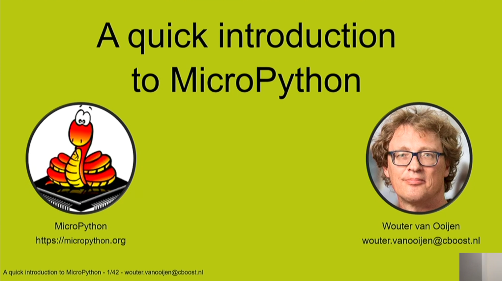
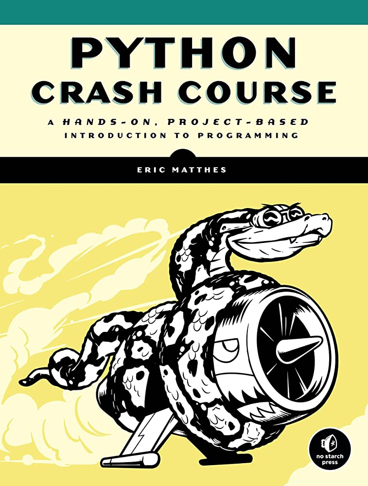

# The Explosively Popular & Powerful Python Programming Language
## An Overview of the language and its recent use for programming microcontrollers

* I have been using Python for almost a quarter of a century now.
* In 2000, I read Mark Lutz's book **Learning Python** and used a project example from the book to build an online CGI website for automating the administration of a squash box-league at Kodak.
* When I first learned Python, the language was much smaller, but already quite powerful

## Factors contributing to Python's explosive popularity

* Powerful, yet beginner friendly
* High level
    * Easy to learn
    * Easy to read
    * Easy to write
    * FUN to use
* Designed to have a compact core but to be highly extensible via modules.
    * This has enabled the creation of an immense ecosystem of libraries and extension modules

* Python has become popular in many diverse fields of interest
    * General scripting
    * Hacking (both ethical and non-ethical)
    * Server-side scripting language for Web Applications
    * Data Science
    * Scientific Computing
    * AI
    * Machine Learning
    * 3D graphics
    * Computer vision
    * Games
    * Natural language processing

* Designed to be a high-level programming language
    * having a strong abstraction from the details of the computer
    * uses natural language elements, making it more intuitive and easy to use
    * uses **indentation** to define code blocks
    * automates or hides low-level details of the interface with the computer
        * eg.: memory management
            * Allocation
            * Deallocation (automatic garbage collection)
            * the stack
            * the heap
    * Dynamically typed

* Designed to be a general-purpose programming language that can be extended by importing modules

* Supports multiple programming paradigms
    * Object-oriented programming (OOP)
        * A programming paradigm based on the concept of "objects", which can contain data and code. The data is in the form of fields (often known as attributes or properties), and the code is in the form of procedures (often known as methods)
    * Structured programming
        * A programming paradigm aimed at improving the clarity, quality, and development time of a computer program by making extensive use of the structured control flow constructs of selection (if/then/else) and repetition (while and for), block structures, and subroutines.
    * Functional programming
        * A programming paradigm where programs are constructed by applying and composing functions. It is a declarative programming paradigm in which function definitions are trees of expressions that map values to other values, rather than a sequence of imperative statements which update the running state of the program.
In functional programming, functions are treated as first-class citizens, meaning that they can be bound to names (including local identifiers), passed as arguments, and returned from other functions, just as any other data type can.

* Pyhon code is **interpreted**, not **compiled**

## What does it mean for a language to be Interpreted vs Compiled?

* In a **compiled** language
    * Source code must be converted (compiled) into machine code so that it can be executed by the processor.
        * This machine code will run **only** on the target device for which it was compiled.
            * Windows, MacOS, Linux, etc.
        * Once compiled, the code can run very fast.
        * Ideal for a device with limited resources because the machine code runs directly on the CPU.
* In an **interpreted** language
    * Source code instructions are read and executed sequentially at run time.
        * A significant advantage of an interpreted language is that it does not have to be compiled for each hardware target separately.
        * A disadvantage is that interpreted code does not run as fast as compiled code.
        * A Python interpreter is available for pretty much every computer operating system.
        * However, an interpreter is too big to fit on a microcontroller.

##  What languages can be used to program a Microcontroller?
* Because of the limited resources (processor speed, ROM, RAM) available on a microcontroller, a **compiled** language (such as C) has long been the obvious choice. For Arduino, the one obvious choice is **C for Arduino**.
* A full-fledged Python3 interpreter is too big to fit on a microcontroller. So the developers have created a special version of Python with stripped-down libraries that will fit on a microcontroller. This is known as MicroPython (Python for Microcontrollers).
* MicroPython, has been written in C to be compatible with Python version 3.4 but has been optimized to run on a microcontroller. It consists of a Python compiler to bytecode and a runtime interpreter of that bytecode. It includes a selection of core Python libraries plus some modules which give the programmer access to low-level hardware of the microcontroller.

## The topology of the MicroPython configuration
* Last month at FOSDEM'23, Wouter van Ooijen presented an excellent talk [A Quick Introduction to MicroPython](https://ftp.osuosl.org/pub/fosdem/2023/UD2.218A/python_micropython_intro.mp4).
* His slides will help us visualize the configuration of MicroPython setup to run on a microcontroller.

## How is MicroPython the same / different from Python?
* The syntax and coding style of MicroPython is the same as full Python (Python3).
* Python is designed to run on larger and more powerful processors such as a desktop or a laptop computer. MicroPython is designed to run on smaller, cheaper, and low power microcontrollers such as PyBoards, Raspberry Pi Boards, and Arduino Boards.
* MicroPython is a *stripped-down* version of full Python
* Wheras Python has hundreds of thousands of libraries, these are not availble for use by MicroPython.
* Instead, the MicroPython developers have created a set of special *light-weight* libraries (many having a `*.upy` file extension) for use on devices with limited resources.

## What is CircuitPython?
* CircuitPython is a derivative of MicroPython, developed by Adafruit, intended to emphasize and facilitate the learning proccess. Their goal is to make the learning process:
    * Beginner Friendly
    * Quick and Easy
    * Provide online support for questions related to their boards.
* Similar to MicroPython, the developers have created a set of special *light-weight* libraries (with a `*.mpy` file extension) that work with CircuitPython
* The Adafruit website provides detailed 'How-To' instructions that accompany each of their boards.
    * Detailed instructions for loading the latest version of CircuitPython 
    * The available libraries for each board are different, depending on the capabilities of the particular board.
    * Detailed example projects are presented, along with *Project bundles* for download

## My personal segue into CircuitPython:

* I got an email from fellow HOT club member Gerald Swan about this [Perpetual Battery-Free Weather Station]( https://makezine.com/projects/perpetual-battery-free-weather-station/) project that piqued my curiosity because it promised to introcduce me to several things I was curious about:
    * Battery free using
        * Solar cell
        * superCapacitor
    * CircuitPython using the Adafruit Metro M0 Express board
    * LoRa
    * Custom Circuit board
    * Time Required: 1–3 Hours  Difficulty: Easy  Price: $0-$50

* I **jumped in** and ordered the Metro, the solar cells, the supercapacitors and the circuit board.
* Then I found myself looking online for tutorials on how to solder an 80 pin surface mount microcontroller
* That was when I realized that this project was **not** going to be even **close to EASY & CHEAP**.

* So then I thought: Well, I can still play with the solar cells and build a solar car with a battery to allow it to drive through shady areas
    * I found another project onlne that showed how to use Solar cells to charge a battery
        * So I ordered some battery charger modules
        * and some linear voltage regulators
        * and some more solar cells

* And I can still play with the Metro and learn CircuitPython
    * Leading to a couple of potential projects
        * Grandfather clock regulator
        * Controller for carriage lights
    
### How I got started with CircuitPython using the Adafruit Metro M0 Express

#### Installing CircuitPYthon on the Metro M0

#### Installing the Mu Editor on my laptop

#### At this point, I decided to present this talk on MicroPyhon / CircuiPython
* I began to search the internet for information about MicroPython / CircuitPython
* I hit the mother lode!

## Some relevant links:
* Video (55 min) presented at FOSDEM '23 [An Introduction to MicroPython](https://ftp.osuosl.org/pub/fosdem/2023/UD2.218A/python_micropython_intro.mp4)
* Random Nerd Tutorials [Getting Started with Thonny MicroPython (Python) IDE for ESP32 and ESP8266](https://randomnerdtutorials.com/?s=flash+firmware+onto+8266)
* [Sonoff DIY Smart Switch Project](https://drive.google.com/file/d/1whJVSwAy5lDRt20VTkXW4LZ6KZNcHsqH/view)
* [What is the difference between Python and MicroPython?](https://www.educative.io/answers/what-is-the-difference-between-python-and-micropython)

* [MicroPython vs Python](https://linuxhint.com/micropython-vs-python-comparison/)

* Video: [CircuitPython vs Micropython](https://core-electronics.com.au/videos/circuitpython-vs-micropython-key-differences)

* Video: [Basic Comparison Between MicroPython and Arduino](https://www.youtube.com/watch?v=4eL5tQLDE2o)

* [Official MicroPython Website](https://micropython.org/)
* Official [pyboard](https://store.micropython.org/pyb-features)

* Video [Most Popular Programming Languages](https://statisticsanddata.org/data/the-most-popular-programming-languages-1965-2022-new-update/)
* Asked on CircuitPython Forum if there is a [library to send emails](https://forums.adafruit.com/viewtopic.php?p=963132#p963132) like uMail in MicroPython

## How you can get started learning Python

* Reuven Lerner's Free online course **Python for non-programmers**
* **Python Crash Course** No-Starch Press

* Start right in with a Raspberry Pi Pico W ($15) and this excellent beginners book from Raspberry Pi Foundation

